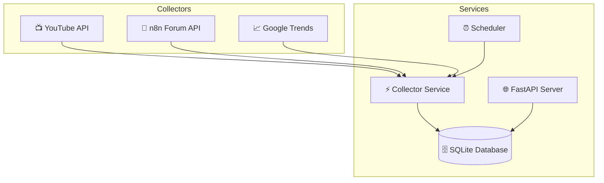

# 🌟 N8N Workflow Popularity System

A **production-ready** system that identifies the most popular **n8n workflows** across multiple platforms with **clear evidence of popularity**.

---

## ✨ Features

* 📊 **Multi-platform data collection**: YouTube, n8n Forum, Google Trends
* 🔥 **Rich popularity metrics**: Views, likes, engagement ratios, trend analysis
* 🌍 **Country segmentation**: US 🇺🇸 and India 🇮🇳 focus
* ⚡ **REST API**: JSON responses with filtering
* ⏰ **Automated collection**: Daily cron jobs with scheduler
* 🐳 **Production-ready**: Docker support, logging & error handling

---

## 🚀 Quick Start

### 1️⃣ Setup Environment

```bash
git clone https://github.com/ArchitJ6/n8n_workflow_popularity.git
cd n8n_workflow_popularity
cp .env.example .env
```

Edit `.env` and add your **YouTube API key**:

```env
YOUTUBE_API_KEY=your_actual_youtube_api_key
DEVELOPMENT_MODE=true
```

---

### 2️⃣ Install Dependencies (Local Development)

```bash
pip install -r requirements.txt
```

---

### 3️⃣ Run the Application

```bash
python main.py
```

👉 API will be available at:
[http://localhost:8000](http://localhost:8000)

---

### 4️⃣ Docker Deployment (Recommended)

```bash
docker-compose up -d
```

Stops the service:

```bash
docker-compose down
```

---

## 📂 Folder Structure

```bash
n8n_workflow_popularity/
│   .dockerignore
│   .env.example
│   .gitignore
│   docker-compose.yml
│   Dockerfile
│   main.py
│   requirements.txt
│
├── api/              # 🌐 REST API routes (FastAPI)
│   └── routes.py
│
├── collectors/       # 📊 Collectors for each platform
│   ├── forum_collector.py
│   ├── google_trends_collector.py
│   ├── youtube_collector.py
│
├── config/           # ⚙️ Configuration files
│   └── __init__.py
│
├── data/             # 💾 SQLite database & persistent data
│   └── workflows.db
│
├── database/         # 🗄️ Database management & CRUD
│   └── db_manager.py
│
├── scheduler/        # ⏰ Automated cron jobs
│   └── scheduler.py
│
├── schema/           # 📐 Data schemas & models
│   └── data_schema.py
│
└── services/         # 🛠️ Business logic & service layer
    ├── collector_service.py
    └── workflow_service.py
```

---

## 🌐 API Endpoints

### 🔹 `GET /workflows`

Get all workflows with optional filters

**Query Params:**

* `platform` → YouTube, Forum, Google
* `country` → US, IN

Example:

```bash
curl "http://localhost:8000/workflows?platform=YouTube&country=US"
```

---

### 🔹 `POST /workflows/refresh`

Manually trigger data collection

---

### 🔹 `GET /workflows/stats`

Get collection statistics

---

### 🔹 `GET /health`

Health check endpoint

---

## 🗂️ Data Sources

* **📺 YouTube Data API v3** → Views, likes, comments, engagement ratios
* **💬 n8n Forum API (Discourse)** → Views, likes, replies, engagement score
* **📈 Google Trends (pytrends)** → Average interest, trend change %, peak interest

---

## 🛠️ Architecture



---

## 🗄️ Database Schema

```sql
CREATE TABLE workflows (
    id INTEGER PRIMARY KEY AUTOINCREMENT,
    workflow TEXT NOT NULL,
    platform TEXT NOT NULL,
    popularity_metrics TEXT NOT NULL, -- JSON stored as text
    country TEXT NOT NULL,
    last_updated TEXT NOT NULL,
    UNIQUE(workflow, platform, country)
);
```

---

## ⚙️ Configuration

Set in `.env`:

* `YOUTUBE_API_KEY` → YouTube API key
* `DEVELOPMENT_MODE` → true/false
* `DATABASE_PATH` → Default: `./data/workflows.db`
* `COLLECTION_SCHEDULE` → Cron syntax (default: daily at 2AM)

---

## 📊 Expected Output

* YouTube → **40–60 workflows**
* Forum → **30–50 workflows**
* Google Trends → **20–30 workflows**
* ✅ **Total: 90–140+ workflows**

---

## 🛡️ Production Considerations

* 🔄 **Async collection** (concurrent API calls)
* 🚦 **Rate limiting** respected
* 🛑 **Error handling & logging**
* ❤️ **Health checks** available at `/health`
* 📦 **Scalable & Dockerized**

---

## 🐞 Troubleshooting

1. **YouTube API quota exceeded** → Check Google Cloud Console quotas
2. **Forum API rate limiting** → Add delays or exponential backoff
3. **Google Trends blocking** → Add longer delays or rotating proxies
4. **SQLite lock issues** → Ensure proper connection handling